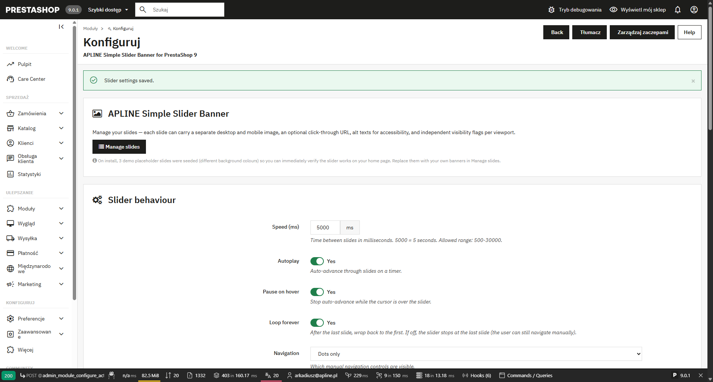
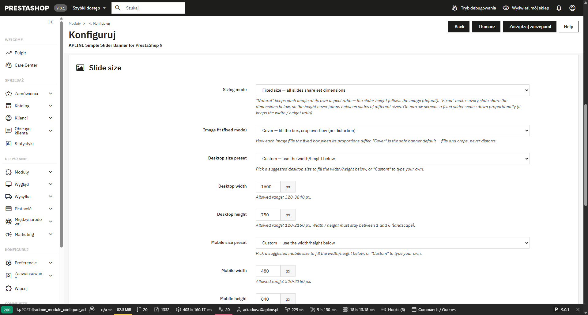
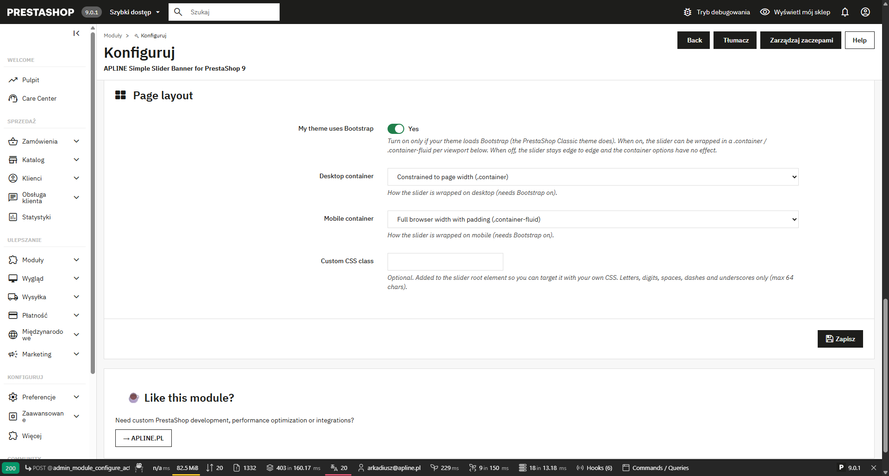
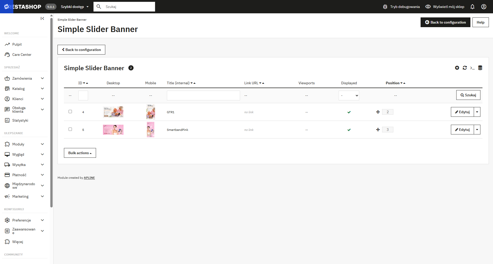
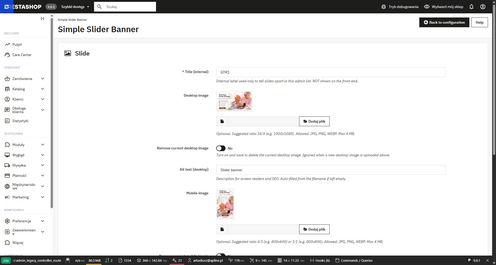
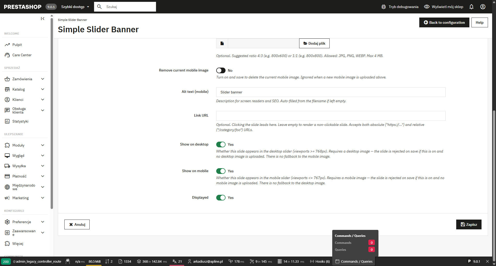

# APLINE Simple Slider Banner for PrestaShop 9

A lightweight, distributable PrestaShop **9.0.x** module that displays
a configurable **image slider / carousel** with **separate desktop
and mobile images per slide**. Two independent sliders are rendered and
toggled by a CSS media query at the 767px breakpoint — the right banner
for each viewport, with no JavaScript scaling. Optional click-through
URL, per-image alt text, drag-and-drop ordering and on/off toggles per
viewport. Configurable navigation (dots / arrows / both / none),
transitions (slide / fade), **fixed slider dimensions** and a
**per-viewport Bootstrap container**. Vanilla JS, no Swiper, no Glide,
no jQuery on the front-end.

> Created by **[APLINE](https://apline.pl)** — custom PrestaShop
> development, performance optimization and integrations.

---

## ✨ Features

- ✅ **Separate desktop and mobile images** per slide (no more
  stretched 16:9 banners on 4:3 phones)
- ✅ **Two independent sliders** toggled by a CSS `@media` query at
  767px — each viewport fetches only its own image, no `<picture>`
  guesswork and no JS scaling
- ✅ **Fixed slider size (optional, per viewport)** — keep the default
  natural height, or pin every slide to set dimensions so the slider
  height never jumps between images of different sizes. Pick a
  **suggested preset** or type your own **width × height** inside safe
  bounds; a proportion guard stops you accidentally turning a landscape
  banner into a portrait one. Images fill the box with **Cover** (crop,
  no distortion — default), **Fill** (stretch) or **Contain**
  (letterbox). A fixed slider scales down proportionally on narrow
  screens.
- ✅ **Per-viewport Bootstrap container** — if your theme uses
  Bootstrap, wrap the slider in `.container` or `.container-fluid`,
  chosen **separately for desktop and mobile**. An explicit
  "My theme uses Bootstrap" switch gates it (no unreliable
  auto-detection); off by default, leaving the slider edge to edge.
- ✅ **WebP support** in the upload pipeline (JPG / PNG / WEBP all
  accepted)
- ✅ Per-slide **click-through URL** (empty = non-clickable slide,
  rendered as `<div>` not `<a>`)
- ✅ Independent **show-on-desktop / show-on-mobile** toggles — strict
  per viewport: a slide appears on a viewport only when both its flag
  and its matching image are set (no silent fallback)
- ✅ Per-image **alt text** for accessibility and SEO, auto-filled
  from the file name if left empty
- ✅ **Auto-renders on the home page** (`displayHome`) — or anywhere
  via `{widget name='apline_simple_slider_banner'}`
- ✅ Configurable **navigation**: dots only, arrows only, both, or
  none (autoplay-only)
- ✅ Configurable **transition**: horizontal slide or opacity fade
- ✅ **Autoplay** with configurable speed (500-30000 ms), **pause on
  hover** (optional), **loop forever** or stop after the last slide
- ✅ Optional **custom CSS class** added to both slider roots for your
  own styling hooks
- ✅ **Touch swipe** on mobile (50 px threshold, passive listeners)
- ✅ **Keyboard accessibility** — Tab to dots/arrows, Enter/Space to
  activate, `aria-selected` toggle on dot buttons
- ✅ **Drag & drop** ordering in the admin, enable/disable per slide
- ✅ Strict, English-only validation:
  - title required, 255-char limit (rejected, never silently
    truncated)
  - URL format check via `Validate::isUrl` (accepts both absolute
    `https://...` and relative `/category/foo`)
  - at-least-one-image, at-least-one-viewport, alt-required-when-image
  - fixed dimensions rejected when out of range or wrong orientation
    (never silently clamped)
  - image upload hardened: **JPG / PNG / WEBP only**, real MIME
    inspection (not just the extension), **4 MB** size cap → blocks
    disguised executables
  - **Remove current image** switch per file slot — clear an image
    without uploading a replacement
- ✅ **Crash-safe**: a rendering or data error yields an empty block,
  never a 500; a failed install rolls back to a clean state
- ✅ **3 demo slides seeded at install** (steel blue / purple / brown
  placeholders generated on the fly via PHP GD) so you can verify
  the slider works immediately
- ✅ Multiple sliders on one page supported (each gets its own JS
  instance)
- ✅ No DRM, no telemetry
- ✅ Public GitHub, custom attribution license, modifiable
- ✅ Released for **PrestaShop 9**

## 📦 Requirements

- PrestaShop **9.0.x** (tested on 9.0.1; not supported on 1.7 / 8.x
  — the module's `ps_versions_compliancy` blocks installation outside
  9.0.x)
- PHP compatible with your PrestaShop 9 install
- PHP **GD extension** (mandatory for PrestaShop anyway, used here for
  on-the-fly placeholder seed generation at install time — if GD is
  missing the install still succeeds, just without demo slides)
- Writable `views/img/` directory (for slide image uploads)
- The **per-viewport Bootstrap container** option only does something
  if your theme loads Bootstrap (the PrestaShop Classic theme does).
  Everything else works on any theme.

> Always test on a staging copy of your shop before installing on
> production. The module is crash-safe by design (a render error
> yields an empty block, never a 500), but every shop's theme and
> module mix is different.

## 🚀 Installation

**Via Back Office**

1. Download `apline_simple_slider_banner.zip` from the
   *Releases* page on GitHub. The archive contains the
   `apline_simple_slider_banner/` folder at its root with
   forward-slash paths.
2. *Modules → Module Manager → Upload a module* → select the ZIP →
   install.

**Via FTP**

1. Upload the `apline_simple_slider_banner/` folder to `modules/`.
2. *Modules* → find **APLINE Simple Slider Banner for PrestaShop 9**
   → Install.

On install, 3 demo placeholder slides are created with distinct
background colours (steel blue, muted purple, warm brown) so you can
verify the slider works on your home page immediately. Replace them
with your own banners via *Configure → Manage slides*.

## 🧹 Uninstall

**From Back Office** (recommended): *Modules → Module Manager → find
**APLINE Simple Slider Banner for PrestaShop 9** → Uninstall*.

Uninstall is **destructive and idempotent**:

- the `ps_assb_slide` table is dropped — all slide definitions are
  deleted
- all uploaded images in `views/img/assb_*` are removed from disk
  (including the seeded demo placeholders)
- all `ASSB_*` configuration entries are removed
- the hidden admin tab (`AdminAplineSimpleSliderBannerSlide`) is
  removed
- module hook registrations are unregistered

If you want to keep your slide definitions, **back up the
`ps_assb_slide` table and the `views/img/` folder before
uninstalling**. There is no built-in export.

## ⚙️ Usage

The configuration page is grouped into three panels.

### 1. Slider behaviour

- **Speed** — milliseconds between auto-advance (5000 = 5 sec)
- **Autoplay**, **Pause on hover**, **Loop forever** — three
  independent switches
- **Navigation** — dots / arrows / both / none
- **Transition** — slide (horizontal) or fade (opacity)

### 2. Slide size

- **Sizing mode** — *Natural height* (default; the slider follows each
  image's own proportions) or *Fixed size* (every slide shares the
  dimensions you set, so the height never jumps).
- **Image fit** (fixed mode) — *Cover* (fills and crops, never
  distorts — the safe banner default), *Fill* (stretches exactly to
  the box, may distort) or *Contain* (whole image, may show empty
  bars).
- **Desktop / Mobile size** — pick a suggested **preset** or type your
  own **width** and **height** in pixels, separately per viewport.
  Values outside the allowed range, or proportions that would flip a
  landscape banner into a portrait one, are rejected with a clear
  error. A fixed slider keeps its width / height ratio and scales down
  proportionally on screens narrower than the chosen width.

### 3. Page layout

- **My theme uses Bootstrap** — turn on only if your theme loads
  Bootstrap (the Classic theme does). When on, the two selects below
  wrap the slider in a `.container` / `.container-fluid` **per
  viewport**. When off, the slider stays edge to edge and the
  container options have no effect.
- **Desktop container** / **Mobile container** — *Edge to edge*,
  *Constrained to page width (.container)* or *Full browser width
  (.container-fluid)*, chosen independently for each viewport.
- **Custom CSS class** — optional class added to both slider roots so
  you can target the slider with your own CSS.

### 4. Manage slides

*Configure → Manage slides* → *Add new slide*. For each slide:

- **Title** (internal, not shown on the front-end — just helps you
  tell slides apart in the admin list)
- **Desktop image** + **Alt text (desktop)**
- **Mobile image** + **Alt text (mobile)**
- **Link URL** (optional) — clicking the slide leads here; leave
  empty for a non-clickable slide. Both absolute (`https://...`) and
  relative (`/category/foo`) URLs work.
- **Show on desktop** / **Show on mobile** — independent switches. A
  viewport only shows the slide when its switch is on **and** the
  matching image is uploaded (no cross-viewport fallback).
- **Active** — global on/off

> **Tip:** match each image's proportions to your chosen slider size.
> In *Cover* mode (the default) mismatched images are cropped to fill,
> never distorted — but you keep the most of your artwork when the
> source ratio is close to the slider ratio.

Reorder slides by drag & drop. The order in the admin list is the
order they appear on the front-end.

### 5. Embed elsewhere (optional)

```smarty
{widget name='apline_simple_slider_banner'}
```

Drop this anywhere in your theme to render the slider, regardless of
the home-page hook.

## 🖼️ Screenshots

### Configuration

The settings page is grouped into three panels.

**Slider behaviour** — speed, autoplay, pause-on-hover, loop, navigation
and transition (plus the *Manage slides* entry point):



**Slide size** — natural height or a fixed size shared by every slide,
set independently for desktop and mobile, with presets and an image-fit
mode:



**Page layout** — the "My theme uses Bootstrap" switch and a per-viewport
`.container` / `.container-fluid` choice, plus an optional custom CSS
class:



### Slides management

Drag-and-drop list with a desktop and a mobile thumbnail per slide:



The slide editor — separate desktop and mobile images, per-image alt
text, an optional click-through URL and independent per-viewport
visibility:





## 🛠️ Troubleshooting

### "This file doesn't seem to be a valid zip module"

PrestaShop's installer requires that the **folder name**, the **main
`.php` file name** and the **PHP class name** all match — and the zip
must contain that folder at its root with **forward-slash** paths.

- Re-download the official zip from the GitHub repository's
  *Releases* page; do not rezip the source folder with Windows
  Explorer (it sometimes writes `\` separators that PrestaShop
  rejects).
- If you must rebuild the zip yourself, on PowerShell 5.1 avoid
  `Compress-Archive` — see the build recipe in [CLAUDE.md](CLAUDE.md).

### Slider doesn't show up on the front-end

- The slider auto-renders on the **home page** (`displayHome`). For
  other pages, embed it manually with
  `{widget name='apline_simple_slider_banner'}` in your theme
  template.
- Make sure at least one slide has the **Active** switch on and at
  least one of *Show on desktop* / *Show on mobile* on **with the
  matching image uploaded**.
- Clear the PrestaShop cache (*Advanced Parameters → Performance →
  Clear cache*).

### The container option does nothing

The **Desktop / Mobile container** selects emit Bootstrap's
`.container` / `.container-fluid` classes. They only have a visible
effect if **My theme uses Bootstrap** is on **and** your theme
actually loads Bootstrap. On a non-Bootstrap theme, leave the switch
off and use *Edge to edge* (or your own Custom CSS class).

### The slider height looks wrong / images are cropped

- In **Fixed size** mode, images fill the box per the **Image fit**
  setting. *Cover* crops to fill (no distortion); switch to *Contain*
  to see the whole image (with empty bars), or *Fill* to stretch.
- Set a **Desktop** and **Mobile** size whose proportions match your
  artwork to minimise cropping.
- In **Natural height** mode the slider follows each image, so slides
  of different sizes will change the slider height — switch to
  *Fixed size* to keep it constant.

### Image upload fails / silent rejection

- The upload folder `modules/apline_simple_slider_banner/views/img/`
  must be writable by PHP. A red warning on the configuration page
  signals it is not — fix the permissions (`chmod 0775` on Linux).
- Only **JPG / PNG / WEBP** files up to **4 MB** are accepted. The
  module inspects the real file content, not just the extension —
  renamed executables will be rejected as "not a valid image".
- To clear an existing image without uploading a new one, toggle
  **Remove current desktop image** or **Remove current mobile image**
  on the edit form and save.

### Demo slides didn't appear after install

The seed step requires PHP's GD extension and a writable
`views/img/` directory. If either is missing, install still
succeeds but the slide list starts empty. Add your own slides via
*Manage slides*. You can verify GD is loaded by running
`php -m | grep -i gd` on your server.

## 📝 License

Custom Attribution License v1.0 — see [LICENSE.md](LICENSE.md).

You may use, modify, distribute and ship this module commercially
and in client projects. You may **not** remove or hide the APLINE
attribution link on the module configuration page. The attribution
must stay visible, link to <https://apline.pl>, and use a readable
font size (≥ 12px).

## 🏢 About APLINE

Need custom PrestaShop development, performance optimization or
integrations?

→ **[APLINE.PL](https://apline.pl)**
